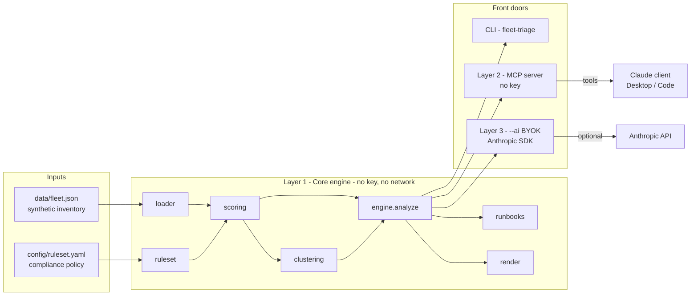

# Architecture

Fleet Triage AI is built as three strictly dependency-ordered layers. The whole
point of the ordering is that the deterministic core is fully usable on its own,
and each layer above it is optional and additive.

## The one rule

`engine.analyze(FleetData, Ruleset) -> FleetReport` is the single public seam.
The CLI, the MCP server, and the AI layer all call it and nothing else, so the
terminal report, the JSON output, and the "talk to your fleet" answers are always
computed from the same code. There is no second scoring path to drift out of sync.

## Dependency direction (enforced by imports)

- `core` (`models`, `ruleset`, `loader`, `scoring`, `clustering`, `engine`,
  `render`, `runbooks`, `generator`) imports only the standard library, `rich`,
  and `pyyaml`. It never imports `mcp` or `anthropic`.
- `mcp_server` imports `core` + `mcp` (the `[mcp]` extra).
- `ai` imports `core` + `anthropic` (the `[ai]` extra), lazily, only when invoked.

This is why `pip install -e .` (core only) gives a fully working tool: the optional
extras are genuinely optional.

## Determinism

`generator.py` seeds `random.Random(1337)` and plants *correlated* faults (patch
drift on render-nodes, encryption-off on one location's edit-bays, stale booths),
so the clustering surfaces story-shaped findings and the committed `data/fleet.json`
is byte-reproducible. The engine takes an `as_of` timestamp from the data file
(not the wall clock) so staleness math — and therefore every score — is stable over
time. Golden-value tests pin the resulting aggregates.
